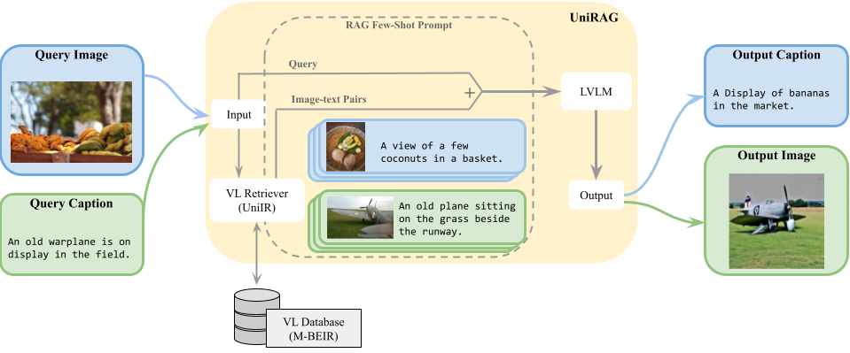

# UniRAG
This repository is the codebase for paper [UniRAG: Universal Retrieval Augmentation for Multi-Modal Large Language Models](https://arxiv.org/abs/2405.10311), accepted in NAACL2025 Findings.
<p align="center">

</p>

# Prerequirements
This repository works with [UniIR](https://github.com/TIGER-AI-Lab/UniIR)'s BLIP_FF and CLIP_SF retreivers and its M-BEIR dataset. Before proceeding to the next step, you should follow its instructions for [unirag](https://github.com/TIGER-AI-Lab/UniIR/tree/main?tab=readme-ov-file#unirag-evaluation) eval to get the retrieved candidates in a jsonl file. As shown below, each line entry in this file will be a json object containing the query as well as its retrieved candidates and complement candidates that together make the image, text pairs used as in context examples in the generation step.
```json
{
    "query": {
        "qid": "9:6", "query_txt": null, "query_img_path": "mbeir_images/mscoco_images/val2014/COCO_val2014_000000391895.jpg", "query_modality": "image", "query_src_content": null, "pos_cand_list": ["9:2", "9:3", "9:4", "9:5", "9:6"], "neg_cand_list": [], "task_id": 3
    },
    "candidates": [
        {"txt": null, "img_path": "mbeir_images/mscoco_images/val2014/COCO_val2014_000000391895.jpg", "modality": "image", "did": "9:1", "src_content": null},
        ...,
        {"txt": "A man riding on the back of a motorcycle down a road.", "img_path": null, "modality": "text", "did": "9:14174", "src_content": null}
    ],
    "complement_candidates": [
        {"txt": "Man riding a motor bike on a dirt road on the countryside.", "img_path": null, "modality": "text", "did": "9:3", "src_content": null},
        ...,
        {"txt": null, "img_path": "mbeir_images/mscoco_images/val2014/COCO_val2014_000000214369.jpg", "modality": "image", "did": "9:14173", "src_content": null}
    ]
}
```

At end of this step you should have the following base dirs configured:
- `base_mbeir_path` is where you have downloaded and extracted the M-BEIR dataset.
- `base_retrieval_path` is where the UniIR retrieval results will be stored. If you follow the UniIR instructions it would be a path ending in `/retrieval_results`

# Installation
We recommend separate conda environments for retrieval(UniIR) vs generation (UniRAG).


# Setting API Keys for GPT and Gemini Models


# Caption Generation

## Evaluation

# Image Generation

## Query Sampling

## Evaluation
